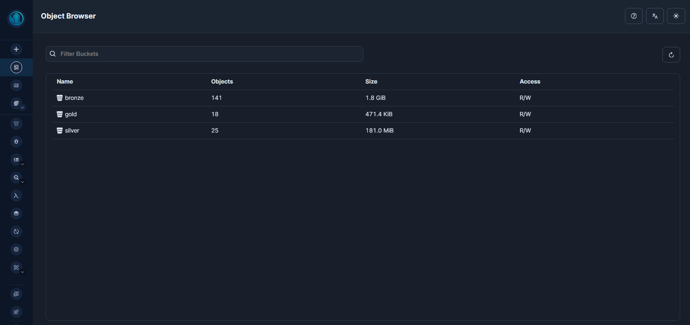
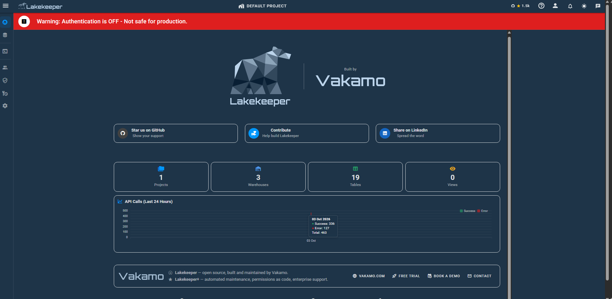
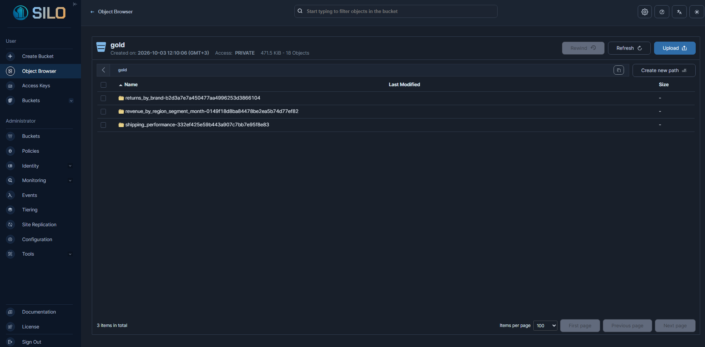
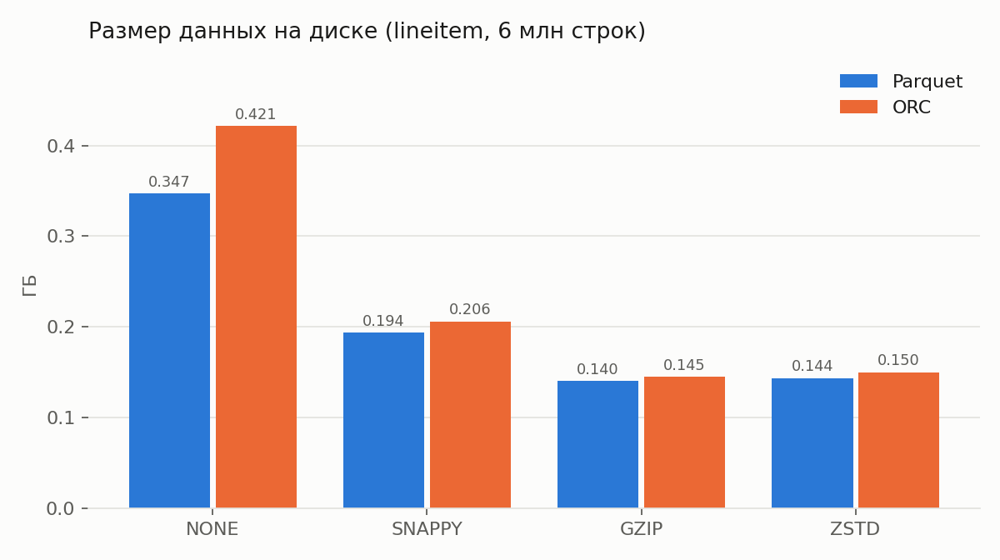
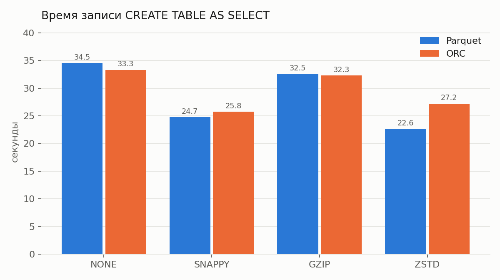
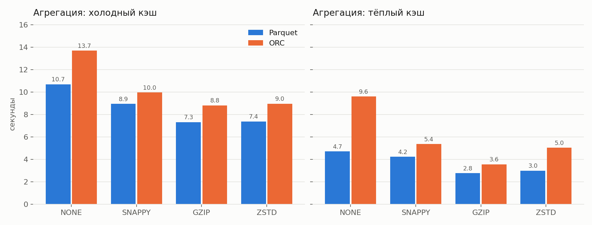
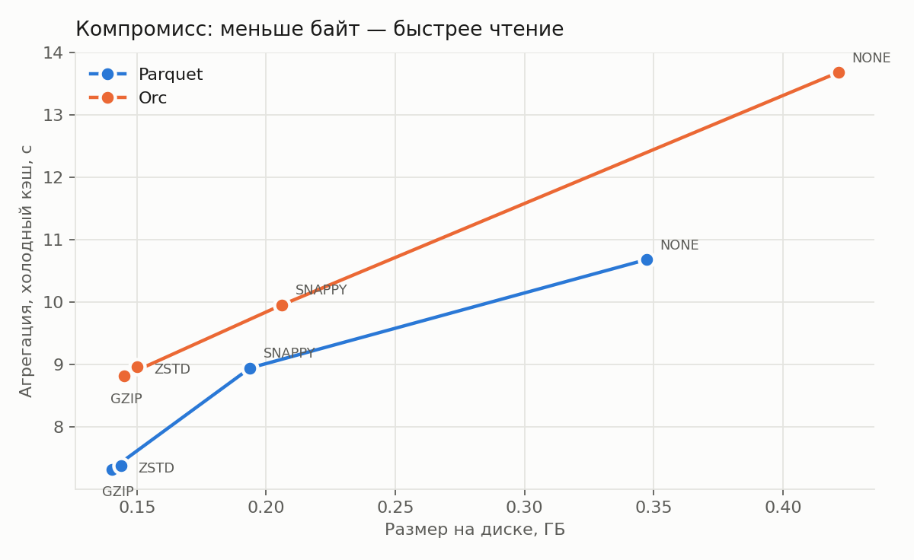

# Практическая работа №1 — Локальный Lakehouse, ELT и бенчмарк форматов/кодеков

Локальный Lakehouse на стеке **MinIO → Lakekeeper (Iceberg REST Catalog) → Trino**,
полный цикл ELT по медальонной архитектуре на данных оптовой торговли (TPC-H)
и бенчмарк **2 форматов × 4 кодеков** по размеру, времени записи и скорости агрегаций.

Всё воспроизводится одной командой: `run.cmd` (Windows) — см. [ШАГИ.md](ШАГИ.md).

---

## 1. Архитектура стенда

```
                    3 бакета              3 warehouse            4 каталога
   ┌─────────┐  bronze ──►  ┌────────────┐  ──►  ┌───────┐
   │  MinIO  │  silver ──►  │ Lakekeeper │  ──►  │ Trino │ ──► SQL / Python
   └─────────┘  gold   ──►  └────────────┘  ──►  └───────┘
        ▲                          ▲                  │
   parquet / orc            Postgres (метаданные)   tpch (генератор)
```

| Компонент | Образ | Роль |
|---|---|---|
| MinIO | `pgsty/silo:latest` | S3-совместимое объектное хранилище, физические файлы данных |
| Postgres | `postgres:17` | хранилище метаданных Lakekeeper |
| Lakekeeper | `quay.io/lakekeeper/catalog:latest-main` | Iceberg REST Catalog: снапшоты, манифесты, схемы |
| Trino | `trinodb/trino:476` | SQL-движок: читает и пишет Iceberg в MinIO |

Каталоги Trino: `bronze`, `silver`, `gold` (Iceberg поверх одноимённых warehouse)
и `tpch` (встроенный генератор-источник).

Три бакета в MinIO после полного прогона — физическое воплощение медальона;
объём убывает от слоя к слою, потому что Gold это уже свёртка, а не строки:



| Бакет | Объектов | Размер | Что лежит |
|---|---|---|---|
| `bronze` | 141 | 1.8 GiB | 8 вариантов `lineitem` + сырые справочники и заказы |
| `silver` | 25 | 181.2 MiB | очищенный факт на 6 млн строк + SCD2-измерение |
| `gold` | 18 | 471.5 KiB | три витрины, 10 074 строки суммарно |

Lakekeeper видит 3 warehouse и 19 таблиц в одном проекте — ровно те, что строит
пайплайн: 8 вариантов бенчмарка и 5 сырых таблиц в Bronze, 3 в Silver, 3 в Gold.



Два момента на этом экране, которые стоит проговорить прямо:

- **«Authentication is OFF»** — стенд поднят без авторизации, все пароли демонстрационные
  (`minioadmin` / `postgres`), секреты лежат открытым текстом в `.properties`. Для
  локальной лабораторной это осознанное упрощение; в эксплуатации Lakekeeper
  подключается к OIDC-провайдеру, а ключи S3 выдаются через STS с коротким сроком
  жизни (в конфигурации стенда `sts-enabled` выключен).
- **127 ошибок API из 463 вызовов** — это не сбои пайплайна: все запросы завершились
  `FINISHED`. Основная масса приходится на `DROP TABLE IF EXISTS` в начале каждого
  скрипта и на повторную регистрацию уже существующих warehouse — каталог честно
  отвечает 404/409, и обращения учитываются как ошибки на уровне HTTP. Скрипты
  идемпотентны по замыслу: их можно перезапускать без ручной чистки.

### Почему именно этот стек

| Решение | Обоснование |
|---|---|
| Три **отдельных** warehouse и бакета вместо одного | слои медальона физически изолированы: права, политики хранения и lifecycle в S3 настраиваются независимо; случайная запись из Gold в Bronze невозможна на уровне каталога |
| Iceberg, а не Delta/Hudi | REST-каталог даёт движко-независимость: те же таблицы читаются Spark/Flink без переноса метаданных |
| Форк `pgsty/silo` вместо `minio/minio` | официальные образы MinIO удалены с Docker Hub, `quay.io/minio/minio` отвечает 401, AIStor требует лицензию. API и переменные окружения совместимы |
| Эндпоинт `host.docker.internal:9000`, не `localhost` | Lakekeeper и Trino живут в контейнерах, для них `localhost` — это они сами |
| Монтируется папка `catalog/` целиком, а не отдельные файлы | добавление нового каталога = новый `.properties` + `docker restart trino`, без пересоздания контейнера |

---

## 2. Данные и отрасль

**Отрасль — оптовая торговля**, эталонный набор **TPC-H**, генерируемый встроенным
коннектором Trino. Коннектор ничего не хранит: строки производятся на лету по
детерминированному алгоритму, поэтому данные воспроизводимы на любой машине
и материализуются в Iceberg через `CREATE TABLE ... AS SELECT`.

**Scale factor = `sf1`** — 6 001 215 строк в `lineitem`, ~0.7 ГБ сырых данных.

> **Обоснование выбора sf1.** Стенд разворачивался на ноутбуке с 16 ГБ RAM и ~50 ГБ
> свободного диска. На `sf10` восемь таблиц заняли бы ~40 ГБ, а Trino в Docker Desktop
> получает примерно половину системной памяти и упирается в `Query exceeded memory`.
> На `sf1` все 8 вариантов занимают 1.75 ГБ, полный прогон укладывается в 25 минут,
> а относительные соотношения между кодеками — именно то, что измеряется, — от
> масштаба не зависят. Масштабирование делается одним флагом: `python 02_benchmark.py --sf 10`.

Ключевая таблица — `lineitem` (строки заказов): 16 колонок, смесь целых, дробных
сумм, процентов, дат и коротких строк. Это осознанный выбор: кодеки по-разному
ведут себя на разных типах, и однородная таблица (только числа или только текст)
дала бы нерепрезентативную картину.

---

## 3. Медальонная архитектура: что сделано на каждом слое

### Bronze — сырьё как пришло

`sql/01_bronze.sql` + `02_benchmark.py`

| Таблица | Строк | Назначение |
|---|---|---|
| `bronze.bench.lineitem_<формат>_<кодек>` × 8 | 6 001 215 каждая | **сырая загрузка в 8 вариантах формат×кодек** — она же предмет бенчмарка |
| `bronze.raw.orders` | 1 500 000 | заказы |
| `bronze.raw.customer_hist` | 161 943 | клиенты, **две загрузки** (append-only) |
| `bronze.raw.part` | 200 000 | справочник товаров |
| `bronze.raw.nation` / `region` | 25 / 5 | география |

Принцип слоя — **append-only**: ничего не перезаписывается. Вторая выгрузка клиентов
(11 943 строки, у которых изменился сегмент и баланс) дописывается рядом с первой,
а не вместо неё. Именно это даёт материал для SCD Type 2 в Silver и для time travel.

> **Решение: бенчмарк живёт внутри Bronze, а не в отдельном каталоге `bench`.**
> Задание требует «загрузить сырые данные в двух форматах с тремя кодеками» — это
> описание слоя Bronze, а не отдельного упражнения. Разместив 8 вариантов в
> `bronze.bench`, мы получаем один непрерывный пайплайн: дальше по медальону идёт
> конкретный вариант (`parquet_zstd` — победитель бенчмарка), а не параллельная ветка.

### Silver — очистка, нормализация, обогащение, история

`sql/03_silver.sql`

**1. Отчёт о качестве данных** (`silver.core.dq_report`) — считается **до** очистки,
чтобы в отчёте была измеренная цифра, а не декларация:

| rows_total | bad_quantity | bad_price | bad_discount | bad_shipdate | bad_returnflag | orphan_orderkey |
|---|---|---|---|---|---|---|
| 6 001 215 | 0 | 0 | 0 | 0 | 0 | 0 |

> **Честная оговорка.** TPC-H — синтетический генератор, он по определению выдаёт
> консистентные данные: ни одна строка не отсеялась, `silver_rows` = `rows_total` =
> 6 001 215. Правила очистки при этом не декоративны — они написаны, выполняются и
> измеряются; на реальной выгрузке из учётной системы счётчики были бы ненулевыми.
> Выдавать «0 брака» за заслугу пайплайна было бы подтасовкой: это свойство источника.

**2. Нормализация:**

| Было в Bronze | Стало в Silver | Зачем |
|---|---|---|
| `extendedprice double` | `gross_amount decimal(12,2)` | деньги во float накапливают ошибку округления при `sum()` |
| `returnflag` = `'A'` / `'N'` / `'R'` | `return_status` = `accepted` / `none` / `returned` | витрина читается без словаря кодов |
| `linestatus` = `'O'` / `'F'` | `line_status` = `open` / `fulfilled` | то же |
| `shipmode` как есть | `upper(trim(...))` | устойчивость к регистру и пробелам источника |

**3. Обогащение** — к каждой строке добавлены:
- расчётные метрики: `net_amount` (цена минус скидка), `net_with_tax`, `discount_amount`;
- логистика: `delivery_days`, `delay_vs_commit`, флаг `is_late`;
- атрибуты из соседних таблиц: `custkey` и `orderdate` из заказов, `brand` и `part_type` из товаров;
- календарь: `order_month`, `order_year` — чтобы Gold не считал `date_trunc` на лету.

**4. SCD Type 2** (`silver.core.dim_customer`) — история клиента через оконную `LEAD()`:

| dim_rows | current_rows | historical_rows |
|---|---|---|
| 161 943 | 150 000 | 11 943 |

У 11 943 клиентов появилась закрытая версия (`valid_to` проставлен, `is_current = false`)
и актуальная. Старые значения не потеряны — отчёт за прошлый период можно пересчитать
в исторической нарезке.

### Gold — витрины для бизнеса

`sql/04_gold.sql`

| Витрина | Строк | Бизнес-вопрос |
|---|---|---|
| `revenue_by_region_segment_month` | 10 000 | как распределена выручка по рынкам, сегментам клиентов и месяцам |
| `shipping_performance` | 49 | какой способ доставки срывает сроки и сколько выручки под риском |
| `returns_by_brand` | 25 | по каким брендам чаще всего возвращают товар |

Клиент подтягивается **в актуальной версии** (`JOIN ... AND d.is_current`) — в этом
практический смысл SCD Type 2: продажи за прошлый год показываются под сегментом,
в котором клиент находится сейчас.

В бакете `gold` каждая витрина лежит отдельной папкой с uuid — Iceberg изолирует
таблицы на уровне хранилища, поэтому пересоздание одной не задевает остальные:



Фрагмент выдачи:

```
   region    | market_segment |      net
-------------+----------------+----------------
 EUROPE      | HOUSEHOLD      | 12364317388.86
 AMERICA     | HOUSEHOLD      | 12306616831.92
 MIDDLE EAST | HOUSEHOLD      | 12246030338.42
```

Сегмент `HOUSEHOLD` лидирует во всех пяти регионах с большим отрывом — прямое
следствие второй выгрузки, переведшей 11 943 клиента в этот сегмент. Это не артефакт
расчёта, а корректное поведение витрины при смене атрибута измерения.

**Time travel.** Iceberg хранит историю версий таблицы; у `bronze.raw.customer_hist`
два снапшота — по одному на каждую загрузку:

```
     snapshot_id     |        committed_at         | operation
---------------------+-----------------------------+-----------
 4009209825564294064 | 2026-10-04 11:33:35.204 UTC | append
 4406925853943647327 | 2026-10-04 11:33:36.449 UTC | append
```

Любой снапшот читается без восстановления из бэкапа:
`SELECT * FROM bronze.raw.customer_hist FOR VERSION AS OF 4009209825564294064`.

---

## 4. Методология бенчмарка

Все замеры выполняет `02_benchmark.py` — один прогон, без ручного секундомера.

**Конфигурация, на которой получены цифры** (с экрана статуса Trino, `docs/08_trino.png`):

| Параметр | Значение |
|---|---|
| Trino | v476, один узел, окружение DOCKER |
| Heap движка | 5.91 ГБ, пул запросов 4.13 ГБ |
| Доступно ядер | 16 |
| Хост | Windows, Docker Desktop на бэкенде WSL2, 16 ГБ RAM |

Все 8 вариантов измерены на одной и той же конфигурации в одном прогоне, поэтому
сравнение между ними корректно; абсолютные секунды привязаны к этому железу
и на другой машине будут иными.

| Метрика | Как измерена | Почему так |
|---|---|---|
| Время записи | `time.perf_counter()` вокруг `CREATE TABLE AS SELECT` с обязательным `fetchall()` | без `fetchall()` клиент Trino возвращает управление до завершения запроса, и замер показал бы время отправки, а не выполнения |
| Размер данных | `sum(file_size_in_bytes)` из системной таблицы `"<table>$files"` | в консоли MinIO файлы разбросаны по uuid-папкам; системная таблица даёт точную сумму по текущему снапшоту |
| Число файлов | `count(*)` оттуда же | объём манифестов растёт от числа файлов, а не от объёма данных |
| Метаданные | `sum(length)` из `"<table>$manifests"` | измеряет накладные расходы Iceberg |
| Агрегация **cold** | TPC-H Q1 после `docker restart trino lakehouse-minio` | «честное» время — первый проход, когда кэш движка сброшен |
| Агрегация **warm** | тот же запрос сразу повторно | верхняя граница «лучшего случая» |

Кодек задаётся **свойством сессии**, а не таблицы:

```python
session_properties = {"bronze.compression_codec": codec}   # NONE | SNAPPY | GZIP | ZSTD
# CREATE TABLE ... WITH (format = 'PARQUET' | 'ORC')
```

В коннекторе Iceberg у Trino `compression_codec` — свойство сессии; попытка передать
его в `WITH (...)` падает с `table property 'compression_codec' does not exist`.
Скрипт дополнительно **проверяет**, что кодек применился (`SHOW SESSION LIKE ...`),
и печатает предупреждение при расхождении — колонка `codec_applied` в `results.csv`
подтверждает, что все 8 вариантов записаны запрошенным кодеком, а не молча
откатились на дефолт.

Агрегация — TPC-H Q1 без `ORDER BY`: полный проход таблицы со свёрткой по двум
колонкам. Читается и суммируется практически вся таблица, поэтому разница между
форматами и кодеками проявляется напрямую, без влияния сортировки и лимитов.

### Ограничения методологии

Три места, где цифры не стоит абсолютизировать:

1. **«Холодный» — это холодный для движка, не для ОС.** `docker restart` гарантированно
   сбрасывает внутренние кэши Trino (метаданные Iceberg, манифесты), но page cache
   ядра внутри WSL2-VM переживает перезапуск контейнера. Часть данных на повторном
   чтении всё равно поднимается из памяти хоста, поэтому разрыв cold/warm (1.4–2.6×)
   — нижняя оценка реального эффекта, на выделенном сервере с холодным диском он был бы больше.
2. **Один прогон на вариант.** Доверительных интервалов нет; расхождения менее ~0.5 с
   между соседними кодеками (например `parquet_gzip` 7.32 с против `parquet_zstd` 7.38 с)
   находятся в пределах шума и не должны трактоваться как устойчивое превосходство.
3. **Побочный эффект 8 перезапусков.** После восьмого `docker restart` Docker Desktop
   потерял слой overlayfs контейнера Trino (`exit 126`, `no such file or directory`),
   и контейнер пришлось пересоздать — `finish.cmd`. Сбой воспроизвёлся и при повторном
   прогоне бенчмарка, то есть это устойчивое поведение Docker Desktop на WSL2, а не случайность. Данные в MinIO и каталог Lakekeeper
   при этом не пострадали: состояние живёт в хранилище и в Postgres, а не в контейнере
   движка. Это, кстати, практическая демонстрация разделения «вычисление ↔ хранение»,
   ради которого Lakehouse и строится.

---

## 5. Результаты

Полные данные — [`results.csv`](results.csv) (воспроизводится прогоном `02_benchmark.py`).

| Вариант | Размер, ГБ | Экономия vs none | Файлов | Метаданные, КБ | Запись, с | Агрегация cold, с | Агрегация warm, с | Ускорение от кэша |
|---|---|---|---|---|---|---|---|---|
| parquet_none | 0.347 | — | 8 | 9.4 | 34.5 | 10.68 | 4.71 | 2.27× |
| parquet_snappy | 0.194 | 44.2 % | 8 | 9.4 | 24.7 | 8.95 | 4.22 | 2.12× |
| **parquet_gzip** | **0.140** | **59.6 %** | 8 | 9.3 | 32.5 | **7.32** | **2.78** | 2.64× |
| **parquet_zstd** | 0.144 | 58.6 % | 8 | 9.3 | **22.6** | 7.38 | 3.00 | 2.46× |
| orc_none | 0.421 | −21.4 % | 8 | 8.8 | 33.3 | 13.68 | 9.60 | 1.43× |
| orc_snappy | 0.206 | 40.6 % | 8 | 8.8 | 25.8 | 9.96 | 5.36 | 1.86× |
| orc_gzip | 0.145 | 58.2 % | 8 | 8.8 | 32.3 | 8.82 | 3.56 | 2.48× |
| orc_zstd | 0.150 | 56.8 % | 8 | 8.7 | 27.2 | 8.96 | 5.03 | 1.78× |

Экономия считается от `parquet_none` (372 813 391 байт) как общей точки отсчёта.

> **Повторяемость.** Бенчмарк прогонялся дважды на одной машине. Размеры, число файлов и
> манифесты совпали с точностью до долей процента (генератор TPC-H детерминирован, разница
> в десятки килобайт — от порядка, в котором параллельные писатели раскладывают строки по
> файлам). Времена записи и чтения между прогонами расходились от долей процента до ~50 % (сильнее всего — тёплое чтение ORC), поэтому выводы
> ниже опираются на устойчивые закономерности, а не на отдельные десятые доли секунды.
> В таблице — второй прогон.









---

## 6. Анализ

### 6.1 Размер: ZSTD догоняет GZIP, не платя за это временем

GZIP сжимает сильнее всех — 0.140 ГБ, в 2.48 раза меньше несжатого Parquet.
ZSTD отстаёт на **2.5 %** (0.144 ГБ, 2.41×). На фоне этого зазора разница в скорости
записи решающая: GZIP пишет 32.5 с, ZSTD — 22.6 с, то есть **на 30 % быстрее**; GZIP, если считать от ZSTD, тратит на 44 % больше времени.

SNAPPY сжимает заметно слабее (1.79×) — он проектировался под максимум пропускной
способности, а не под коэффициент сжатия.

Между форматами на одинаковом кодеке разница невелика и всегда в пользу Parquet:

| Кодек | ORC / Parquet по размеру |
|---|---|
| NONE | 1.214× |
| SNAPPY | 1.064× |
| GZIP | 1.034× |
| ZSTD | 1.044× |

Главный разрыв — на `NONE` (+21 % у ORC). Без внешнего сжатия видна разница во
внутреннем кодировании: лёгкие схемы ORC (RLE, словари) на этих данных дают меньше,
чем кодирование Parquet. Как только включается настоящий кодек, он выравнивает оба
формата — различие падает до 3–6 %. Вывод: **на плоских таблицах формат почти не
влияет на размер, влияет кодек.** Преимущество ORC проявляется на вложенных структурах,
которых в `lineitem` нет.

### 6.2 Запись: несжатое и GZIP — в хвосте, ZSTD в Parquet — впереди

Ожидаемый порядок «чем сильнее сжатие, тем дольше запись» подтвердился **не полностью**:

| Вариант | Запись, с |
|---|---|
| parquet_zstd | 22.6 |
| parquet_snappy | 24.7 |
| orc_snappy | 25.8 |
| orc_zstd | 27.2 |
| orc_gzip | 32.3 |
| parquet_gzip | 32.5 |
| orc_none | 33.3 |
| parquet_none | 34.5 |

`NONE` оказался **самым медленным**, а не самым быстрым — в обоих форматах. Объяснение:
при записи без сжатия на диск уходит в 2.4–2.9 раза больше байт, и выигранное на
процессоре время теряется на вводе-выводе. На медленном диске или по сети этот эффект
только усилится. GZIP — второй с конца: тут уже платит процессор.

Производительность записи в МБ/с (колонка `write_mb_per_sec`) подтверждает ту же
картину с другой стороны: `parquet_gzip` выдаёт 4.4 МБ/с полезных данных против
10.3 МБ/с у `parquet_none` — но несжатому варианту этих мегабайт нужно записать в
2.5 раза больше.

Порядок внутри середины таблицы между прогонами менялся (в первом прогоне `orc_zstd`
был быстрейшим, во втором — четвёртым), а вот хвост из `NONE` и `GZIP` и лидерство
`parquet_zstd` в первой тройке держались оба раза.

### 6.3 Чтение: несжатое читается медленнее всего

Самый контринтуитивный и самый важный результат:

| | cold, с | warm, с |
|---|---|---|
| parquet_gzip (самый маленький) | **7.32** | **2.78** |
| parquet_zstd | 7.38 | 3.00 |
| parquet_none (самый большой из Parquet) | 10.68 | 4.71 |
| orc_none (самый большой вообще) | **13.68** | 9.60 |

Несжатый Parquet читается на **46 % медленнее** сжатого GZIP, а несжатый ORC —
**в 1.55 раза** медленнее сжатого ORC (`orc_gzip`). Причина в том, что узкое место здесь —
не процессор, а объём поднимаемых с диска байт. Распаковать 144 МБ дешевле,
чем прочитать 356 МБ.

GZIP и ZSTD на холодном чтении сравнялись (7.32 против 7.38 с — разница 0.8 %, в пределах
шума), на тёплом GZIP впереди на 8 %. На каждом кодеке Parquet читается быстрее ORC —
и на холодном, и на тёплом кэше.

График «размер против времени чтения» показывает почти линейную зависимость: это
не два конкурирующих параметра, а один — **меньше байт означает и дешевле хранение,
и быстрее аналитика**. Компромисс «размер ↔ скорость» существует только для записи.

### 6.4 Метаданные: доли процента

| | данные | манифесты | доля |
|---|---|---|---|
| parquet_none | 355.5 МБ | 9.4 КБ | 0.0026 % |
| parquet_gzip | 143.7 МБ | 9.3 КБ | 0.0063 % |
| все 8 таблиц | 1.748 ГБ | 72.4 КБ | 0.0040 % |

Накладные расходы Iceberg на таблицах такого размера пренебрежимы. При этом важно,
что объём манифестов **не зависит от объёма данных** — он зависит от **числа файлов**:
каждый файл данных это строка в манифесте. Во всех восьми вариантах файлов ровно 8
(Trino режет запись на куски целевого размера), и манифест везде весит ~9 КБ, хотя
данные различаются в 3 раза.

Отсюда практический вывод: метаданные становятся проблемой не при больших таблицах,
а при **проблеме мелких файлов** — когда тысячи частых мелких вставок порождают
манифесты на десятки МБ и замедляют планирование каждого запроса. В нашем
`CREATE TABLE AS SELECT` этого не происходит.

### 6.5 Кэш: без него бенчмарк недостоверен

Повторный прогон быстрее первого в **1.43–2.64 раза**. Если бы замеры делались
по одному прогону подряд для всех вариантов, первый вариант получил бы холодный
кэш, а остальные семь — тёплый, и таблица результатов показала бы несуществующее
превосходство последних. Именно поэтому в скрипте перед каждым cold-замером стоит
перезапуск стека.

Наибольшее ускорение от кэша — у `parquet_gzip` (2.64×), наименьшее — у `orc_none`
(1.43×): крупный несжатый файл хуже помещается в доступную память, и прогревается
лишь частично. Компактные сжатые варианты (GZIP и ZSTD в Parquet, GZIP в ORC)
выигрывают от кэша сильнее остальных.

---

## 7. Выводы и рекомендации

**Для этого профиля нагрузки — аналитика по широкой плоской таблице — выбор
`PARQUET` + `ZSTD`.**

Обоснование по трём метрикам сразу: сжатие 2.41× (отстаёт от лидера на 2.5 %),
самая быстрая запись из всех восьми вариантов (22.6 с), холодное чтение на уровне
лидера (7.38 с против 7.32 с у GZIP). GZIP выигрывает по размеру на 2.5 % и по
тёплому чтению на 8 %, но платит за это 44 % времени записи — на регулярном
ETL эта плата повторяется ежедневно, а выигранные мегабайты — единоразовы.

Когда брать другое:

| Кодек | Когда оправдан |
|---|---|
| **ZSTD** | по умолчанию: регулярная загрузка + регулярная аналитика |
| **SNAPPY** | горячий слой с частой перезаписью, где критична пропускная способность записи, а хранение дёшево. Цена — в 1.35 раза больше места, чем у ZSTD |
| **GZIP** | архив, холодные данные, которые пишутся один раз и читаются редко. Разница в записи перестаёт иметь значение, а 2.5 % места на петабайтах — уже деньги |
| **NONE** | только как бейзлайн для измерений. В эксплуатации проигрывает по всем трём метрикам сразу, включая скорость |

**Про формат:** на плоских таблицах Parquet и ORC практически эквивалентны по размеру при
включённом сжатии (расхождение 3–6 %), но Parquet на каждом кодеке быстрее ORC по
чтению, а на SNAPPY и ZSTD — и по записи (на GZIP паритет: 32.5 против 32.3 с). Выбирать ORC стоит по экосистемным причинам
(глубокая интеграция с Hive) или под вложенные типы, а не ради размера.

**Про экономику.** Объектное хранилище стоит порядка $0.02–0.03 за ГБ·месяц.
Переход с `NONE` на `ZSTD` сэкономил 0.203 ГБ на одной таблице — около $0.005 в месяц,
то есть на учебном масштабе ничего. Но соотношение сохраняется при росте: на
петабайте данных те же 58.6 % экономии превращаются примерно в $12 000 в месяц,
причём аналитика поверх этих данных становится ещё и быстрее. Выбор кодека — одна
строка в конфигурации, которая окупается тем сильнее, чем больше данных.

---

## 8. Состав репозитория и воспроизведение

```
lakehouse/
├── run.cmd                 полный прогон: стенд → Bronze → бенчмарк → Silver → Gold
├── finish.cmd              пересоздать Trino и доделать Silver + Gold
├── 00_setup.ps1            разворот стенда с проверками готовности сервисов
├── 01_run_sql.ps1          прогон .sql через CLI Trino внутри контейнера
├── 02_benchmark.py         бенчмарк: 8 таблиц, 7 метрик, сброс кэша → results.csv
├── catalog/                4 каталога Trino (монтируется в контейнер)
├── warehouses/             payload для регистрации warehouse в Lakekeeper
├── sql/
│   ├── 01_bronze.sql       сырьё, append-only, две загрузки клиентов
│   ├── 03_silver.sql       DQ-отчёт, SCD Type 2, очистка + нормализация + обогащение
│   └── 04_gold.sql         три витрины + демонстрация time travel
├── docs/                   графики бенчмарка и скриншоты стенда
├── results.csv             результаты бенчмарка
└── ШАГИ.md                 пошаговая инструкция
```

Требуется Docker Desktop и `pip install trino`.

```cmd
cd lakehouse
run.cmd
```

Полный прогон на `sf1` занимает ~35 минут, из них ~25 — бенчмарк (8 перезапусков
стека ради холодных замеров). Масштаб меняется одним флагом: `python 02_benchmark.py --sf 10`.

Остановить и освободить место:

```cmd
docker rm -f trino lakekeeper lakehouse-pg lakehouse-minio
docker volume rm minio-data pg-data
```

---

## 9. Источники

- [Гайд 1. Локальный Lakehouse (MinIO → Lakekeeper → Trino)](https://github.com/m1705161/laba1)
- [Гайд 3. Бенчмарк форматов и кодеков](https://github.com/m1705161/laba2)
- [Trino — Iceberg connector](https://trino.io/docs/current/connector/iceberg.html)
- [Apache Iceberg — спецификация таблиц](https://iceberg.apache.org/spec/)
- [TPC-H Benchmark](https://www.tpc.org/tpch/)
